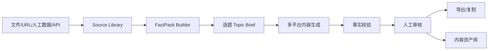

# AI 内容生产中心（AI Content Studio）产品需求文档 PRD

> 文档状态：V1.0  
> 产品形态：独立产品、独立代码仓、独立数据库、独立部署  
> 核心定位：把“可信事实包 + 内容策略 + 模型生成 + 人工审核 + 多平台输出”变成一条可管理的内容生产流水线。  
> **明确约束：本产品不得内嵌或依赖 DreamOAgents，也不依赖财经观点雷达。外部数据只能通过导入/API 进入本产品。**

---

# 1. 产品定义

## 1.1 一句话定义

AI Content Studio 是一个独立的“事实驱动内容生产系统”，支持把结构化数据、研究笔记、文件、URL、人工观点整理成 **FactPack**，然后面向抖音、小红书、公众号等不同渠道生成内容，经过事实校验和人工审核后导出。

## 1.2 为什么不是普通 AI 写作工具

普通 AI 写作的问题：

- 每次 Prompt 临时写
- 多平台重复生成
- 数字容易幻觉
- 无法知道某句来自哪个事实
- 没有版本
- 没有审核流
- 没有内容资产沉淀
- 无法稳定复用品牌风格

本产品核心不是“聊天框”，而是：

```text
Source
→ FactPack
→ Topic Brief
→ Content Job
→ Draft
→ Fact Check
→ Review
→ Export
```

---

# 2. 独立性原则

本产品自己拥有：

- 用户/权限
- PostgreSQL
- Redis
- 对象存储
- 模型配置
- Prompt
- Brand Voice
- FactPack
- 内容资产
- 任务队列
- 审核记录

任何外部系统都视为 Data Source。

未来与“财经观点雷达”互通时：

```text
Radar API → Studio Connector → FactPack
```

而不是：

```text
Studio → Radar DB  # 禁止
```

---

# 3. V1 目标

完整闭环：



V1 首选渠道：

- 抖音：短视频口播脚本
- 小红书：图文
- 微信公众号：长文

V1 不直接自动发布平台，先做到 Generate → Review → Export。

---

# 4. 核心概念

## 4.1 Source

原始材料：

- 文本粘贴
- Markdown
- PDF/TXT/CSV
- 网页 URL
- JSON
- 手工录入数据
- 外部 API Connector

## 4.2 Fact

可被内容引用的最小事实。

示例：

```json
{
  "statement": "某指数当日上涨 1.2%",
  "value": 1.2,
  "unit": "%",
  "as_of": "2026-09-15",
  "source_ref": "src_123",
  "confidence": 1.0
}
```

## 4.3 FactPack

某一期内容生成时唯一允许引用的事实集合。

FactPack 必须版本化。

## 4.4 Topic Brief

告诉模型“今天要讲什么”，不是让模型自由决定事实。

内容：

- 核心主题
- 受众
- 关键观点
- 必须包含的事实
- 禁止内容
- CTA
- 风格
- 渠道

## 4.5 Draft

某平台某版本生成结果。

## 4.6 Claim Citation

Draft 中任何事实性陈述应该能够映射到 Fact ID。

---

# 5. 用户角色

| 角色 | 权限 |
|---|---|
| Admin | 系统/模型/模板/品牌/用户 |
| Editor | Source、FactPack、生成、审核 |
| Reviewer | 只审核和改稿 |
| Viewer | 只读 |

---

# 6. V1 功能范围

## 6.1 Source Library

- 新建文本材料
- 上传文档
- 上传 CSV/JSON
- 添加 URL
- 手工 API Import
- 查看解析状态
- 标记来源可信等级
- 归档

## 6.2 FactPack Builder

- 自动候选事实抽取
- 人工新增 Fact
- 编辑 Fact
- 关联来源
- 标注日期
- 标注数值/单位
- 事实冲突提示
- 版本冻结
- Clone 新版本

## 6.3 Topic Center

- 选题新建
- 选择 FactPack
- 选择目标渠道
- 定义受众
- 定义核心结论
- 定义内容角度
- 定义禁止表述
- 选择 Brand Voice

## 6.4 Generate

一次 Topic Brief 可生成：

- 抖音脚本
- 小红书图文
- 微信公众号文章

各渠道独立模板，但共享同一 FactPack。

## 6.5 Fact Checker

检查：

- 文本内数字是否来自 Fact
- 时间是否匹配
- 公司/人物/产品名称是否来自 Source/Fact
- 模型是否加入 FactPack 外的新事实
- 前后事实是否冲突
- 是否出现“保证收益”等风险词

## 6.6 Review

状态：

```text
draft
fact_check_failed
ready_for_review
changes_requested
approved
exported
archived
```

## 6.7 Asset

V1 支持：

- 封面文案
- 图片生成 Prompt
- B-roll Prompt
- 口播分镜
- 配音文本
- SRT 字幕文本

V1 可以只生成“素材说明/Prompt”，不强依赖某个视频生成平台。

## 6.8 Export

- Markdown
- TXT
- JSON
- SRT
- 一键复制
- 分平台复制

---

# 7. 原型设计

## 7.1 全局布局

```text
左侧导航：
总览
来源库
FactPack
选题中心
内容任务
审核中心
内容资产
模板
设置
```

1440px Desktop First。

产品风格：
- 内容工作台
- 大面积空白 + 高信息密度编辑区
- 编辑器是核心
- AI 操作必须可撤销
- 不做“一个聊天框包办全部”

---

## 7.2 P01 总览

```text
┌────────────────────────────────────────────────────────────────────┐
│ AI Content Studio                         [新建选题] [导入来源]    │
├────────────┬───────────────────────────────────────────────────────┤
│ 总览       │ 本周内容 18 | 待审核 5 | Fact异常 2 | 已导出 11       │
│ 来源库     ├───────────────────────────────────────────────────────┤
│ FactPack   │ 今日工作流                                            │
│ 选题中心   │ 选题             渠道          状态       最后更新     │
│ 内容任务   │ AI行情复盘       抖音/小红书   待审核     10:22       │
│ 审核中心   │ ...                                                   │
│ 内容资产   ├───────────────────────────────────────────────────────┤
│ 模板       │ 最近 FactPack     最近导出      失败任务               │
│ 设置       │                                                       │
└────────────┴───────────────────────────────────────────────────────┘
```

---

## 7.3 P02 来源库

列表字段：

- 标题
- 类型
- 来源
- 日期
- 可信等级
- 解析状态
- Fact 数
- 最近使用
- 操作

右侧 Drawer：

- 原始内容
- 元数据
- 解析结果
- 候选 Facts
- 使用在哪些 FactPack

---

## 7.4 P03 FactPack Builder

这是本产品最核心页面。

```text
┌─────────────────────────────────────────────────────────────────────┐
│ FactPack: 2026-09-15 市场复盘  v3         [保存草稿] [冻结版本]    │
├───────────────────────┬─────────────────────────────────────────────┤
│ Sources               │ Facts                                       │
│ ☑ source A            │ #F001 市场成交额...                         │
│ ☑ source B            │ 日期 2026-09-15 | 可信 1.0                 │
│ ☑ CSV C               │ 来源 source A                               │
│                       │                                             │
│ [+ 添加来源]          │ #F002 AI算力板块...                         │
│                       │ ...                                         │
├───────────────────────┴─────────────────────────────────────────────┤
│ 冲突检测：2 个  | 缺失日期：1 个 | 未确认候选：5 个                │
└─────────────────────────────────────────────────────────────────────┘
```

每条 Fact 操作：

- Edit
- Confirm
- Reject
- Link Source
- Mark stale
- Add note

### 冻结

一旦 FactPack Freeze：

- 不允许原地修改
- 修改必须 Clone 为 vN+1
- 已生成内容永远记录生成时的 FactPack version

---

## 7.5 P04 选题中心

表单：

```text
标题：
目标受众：
目标：
内容角度：
核心结论：
必须包含：
禁止出现：
CTA：
Brand Voice：
FactPack：
渠道：[抖音][小红书][公众号]
```

右侧显示 FactPack Summary。

---

## 7.6 P05 内容生成工作台

```text
┌───────────────────────────────────────────────────────────────────────┐
│ Topic: 今天科技板块为什么走强             FactPack v3               │
├────────────────┬───────────────────────────────────┬──────────────────┤
│ 渠道           │ 编辑器                             │ Fact/Citations   │
│ ● 抖音         │ 【开头 Hook】...                  │ F001 ✅          │
│ ○ 小红书       │ ...                                │ F003 ✅          │
│ ○ 公众号       │                                    │ 新事实 1 ❌      │
│                │                                    │                  │
│ [重新生成]     │                                    │                  │
├────────────────┴───────────────────────────────────┴──────────────────┤
│ FactCheck: 通过 8 | 警告 1 | 失败 1      [进入审核]                 │
└───────────────────────────────────────────────────────────────────────┘
```

### 编辑器要求

- Markdown/Rich Text
- AI 改写“选中文本”，不能默认重写全文
- Undo/Redo
- Draft version history
- Fact 引用侧栏
- Diff 比较

---

## 7.7 P06 抖音脚本结构

模板默认结构：

```text
Hook 3-8s
背景
核心观点 1
证据
核心观点 2
风险/反面信息
总结
CTA
```

输出字段：

- `title`
- `hook`
- `spoken_script`
- `scene_blocks[]`
- `on_screen_text[]`
- `broll_prompts[]`
- `srt_text`
- `estimated_length`（模型估算仅供参考）

---

## 7.8 P07 小红书结构

输出：

- 标题候选
- 正文
- 小标题
- 卡片文案
- 封面标题
- 图片 Prompt
- Tags

严禁默认使用夸张收益、确定性投资承诺。

---

## 7.9 P08 公众号结构

输出：

- 标题
- 摘要
- 导语
- 主体章节
- 风险提示
- 结尾
- 配图建议
- 引用/数据来源列表

---

## 7.10 P09 审核中心

左侧内容，右侧检查结果：

```text
事实问题
- 第 3 段 “增长 20%” 无 Fact 支持 [定位]
- 日期 “今天” 与 FactPack 日期不一致 [定位]

风险词
- “一定上涨” [替换建议]

风格
- 过度口语化 2 处
```

Reviewer：

```text
[退回修改]
[批准]
```

批准前必须 FactCheck 无 blocker。

---

## 7.11 P10 内容资产库

筛选：

- 日期
- Topic
- 平台
- 状态
- 标签
- FactPack
- Brand Voice

每个资产保存：

- 最终稿
- 所有版本
- 使用的 FactPack
- 模型
- Prompt
- 审核人
- 导出记录

---

## 7.12 P11 模板中心

模板层次：

```text
Channel Template
Brand Voice
Content Policy
Prompt Version
```

允许克隆，不允许修改已被历史内容引用的版本。

---

# 8. 数据模型

## `source_document`

```text
id
title
source_type
original_uri
mime_type
source_url
as_of
trust_level
parse_status
raw_text_uri
metadata_json
created_at
```

## `fact`

```text
id
source_document_id
statement
fact_type
subject
predicate
value_json
unit
as_of
valid_from
valid_to
confidence
status
source_locator_json
created_at
```

## `fact_pack`

```text
id
name
description
version
status -- draft/frozen/archived
parent_id
frozen_at
created_by
created_at
```

## `fact_pack_item`

```text
fact_pack_id
fact_id
sort_order
note
```

## `topic_brief`

```text
id
title
audience
goal
angle
core_thesis
must_include_json
forbidden_json
cta
brand_voice_version_id
fact_pack_id
fact_pack_version
status
```

## `content_job`

```text
id
topic_brief_id
channel
template_version_id
model_provider
model_name
prompt_version
status
started_at
finished_at
usage_json
```

## `draft`

```text
id
content_job_id
revision_no
title
body
structured_json
created_by_type -- ai/user
created_at
```

## `draft_claim`

```text
id
draft_id
text
claim_type
start_offset
end_offset
check_status
```

## `draft_claim_fact`

```text
draft_claim_id
fact_id
relation -- supports/conflicts/context
```

## `review`

```text
id
draft_id
reviewer_id
decision
comment
created_at
```

## `content_asset`

最终批准资产。

## `export_record`

记录格式、时间、用户。

## `brand_voice_version`

品牌语气版本。

## `template_version`

渠道模板版本。

## `prompt_version`

模型 Prompt 版本。

## `job_run`

后台任务。

## `audit_log`

---

# 9. FactPack 规则

## 9.1 Fact 状态

```text
candidate
confirmed
rejected
stale
conflict
```

只有 confirmed 能进入 frozen FactPack。

## 9.2 冲突检测

同 subject + predicate + as_of：

出现不同 value → conflict。

系统不能自动挑一个覆盖，必须：
- 标注冲突
- 展示来源
- 人工确认或注明口径

## 9.3 时效

Fact 必须尽可能有 `as_of`。

涉及“今日、当前、最新”的内容生成前：
- 检查 FactPack 是否是目标日期
- stale 事实给 warning/blocker

---

# 10. 内容生成协议

LLM 不直接返回纯文本，优先返回结构化 JSON。

示例抖音：

```json
{
  "title": "今天科技股为什么突然走强？",
  "hook": "今天有一个变化值得注意。",
  "spoken_script": "...",
  "scenes": [
    {
      "index": 1,
      "script": "...",
      "fact_ids": ["F001"],
      "on_screen_text": "...",
      "broll_prompt": "..."
    }
  ],
  "risk_note": "..."
}
```

服务端验证 `fact_ids` 存在于当前 FactPack。

---

# 11. Fact Checker

Fact Checker 分两层。

## 11.1 Deterministic Checker

检查：

- 数字
- 百分比
- 日期
- 股票代码/公司名
- 明确事实性实体
- Fact ID

## 11.2 LLM Reviewer

检查：

- 是否引入 FactPack 外事实
- 是否过度推断
- 原 Fact 是“可能”，稿件是否写成“确定”
- 是否偷换时间范围
- 是否把观点写成事实

输出：

```text
pass
warning
blocker
```

Blocker 未解决不能 approve。

---

# 12. API

前缀 `/api/v1`.

## Source

```text
POST /sources/text
POST /sources/upload
POST /sources/url
GET  /sources
GET  /sources/{id}
POST /sources/{id}/extract-facts
```

## Fact

```text
GET   /facts
PATCH /facts/{id}
POST  /facts/{id}/confirm
POST  /facts/{id}/reject
```

## FactPack

```text
POST /fact-packs
GET  /fact-packs
GET  /fact-packs/{id}
POST /fact-packs/{id}/items
POST /fact-packs/{id}/freeze
POST /fact-packs/{id}/clone
```

## Topic

```text
POST /topics
GET  /topics
GET  /topics/{id}
PATCH /topics/{id}
```

## Generate

```text
POST /topics/{id}/generate
GET  /content-jobs/{id}
POST /drafts/{id}/regenerate-section
POST /drafts/{id}/fact-check
```

## Review

```text
GET  /reviews/queue
POST /drafts/{id}/request-changes
POST /drafts/{id}/approve
```

## Export

```text
POST /assets/{id}/export
```

---

# 13. 模型与 Provider 设计

```python
class LLMProvider(Protocol):
    async def generate_json(...): ...
    async def generate_text(...): ...
```

不能在业务层写 `if minimax`.

配置：

```text
provider
model
api_key_secret_ref
timeout
max_retries
enabled
```

Prompt、Brand Voice、Channel Template 都必须版本化。

---

# 14. 非功能需求

## 14.1 独立运维

- 独立 repo
- 独立 PostgreSQL
- 独立 Redis
- 独立 Bucket
- 独立 Secret
- 独立域名
- 独立监控
- 不与其他产品同进程部署

## 14.2 可恢复

每个生成任务保存：
- input FactPack version
- template version
- prompt version
- model
- raw output
- parsed output
- token/cost usage

任何稿件都能重放。

## 14.3 安全

- URL Import 防 SSRF
- 文件扫描/限制格式
- Secret 加密
- 内容数据按权限访问
- 导出日志
- Prompt 注入防护：来源文本始终当“数据”，不得覆盖系统指令

---

# 15. V1 验收标准

1. 可导入文本、URL、PDF/TXT/CSV 中至少 3 类。
2. Source 能抽取候选 Facts。
3. Fact 可人工确认/拒绝/编辑。
4. FactPack 可冻结并产生不可变版本。
5. Topic 可绑定 frozen FactPack。
6. 一次 Topic 可生成抖音、小红书、公众号 3 个渠道。
7. 生成内容保存模型/Prompt/模板版本。
8. 事实性句子可以映射 Fact。
9. Fact Checker 能阻止明显的“无来源数字”。
10. Reviewer 能退回/批准。
11. 批准内容进入资产库。
12. 可导出 Markdown/TXT/JSON/SRT 中对应格式。
13. 生成失败可重试且不覆盖旧 Draft。
14. 历史 FactPack 更新不会改变已生成内容的证据。
15. 外部系统不可直接访问本产品数据库。

---

# 16. V1 发布门槛

建立至少 30 个真实 Topic 的评测集：

- 10 抖音
- 10 小红书
- 10 公众号

检查：

- 无来源数字率
- Fact 覆盖率
- 人工事实错误率
- 格式通过率
- Reviewer 返工率
- 同一 FactPack 三渠道事实一致性

发布要求：

- Blocker 事实错误不可自动通过
- FactPack 版本不可变验证通过
- Draft 历史不丢失
- 全流程审计可追溯
- 部署/恢复/备份文档齐全

---

# 17. 与财经观点雷达未来集成

Content Studio 只实现 Connector：

```text
connector_type = radar_api
base_url
api_key
```

导入流程：

```text
GET Radar API
→ 存为 source_document
→ 抽/映射 fact
→ 人工确认
→ FactPack
```

Radar 离线或升级不会导致 Studio 核心功能不可用。
